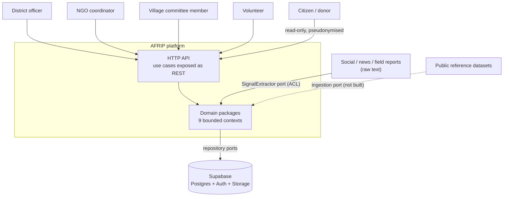
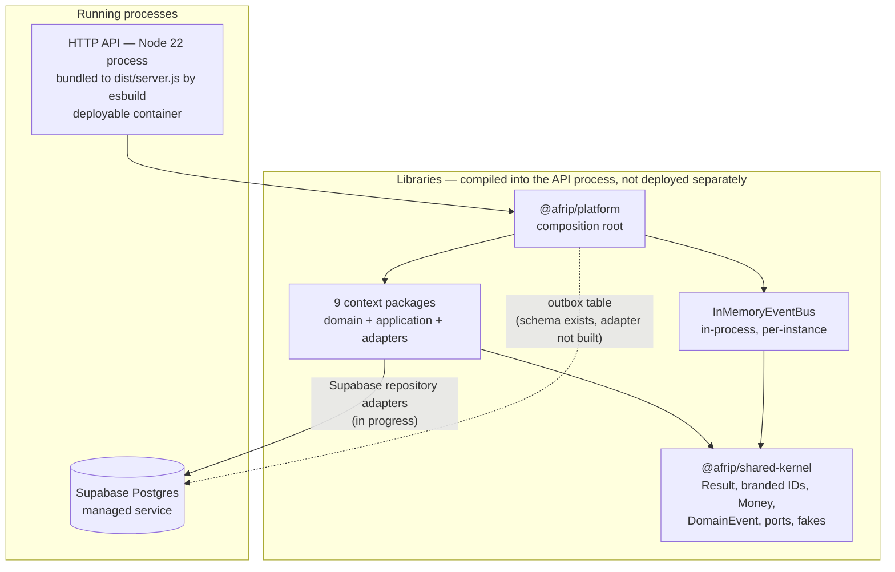
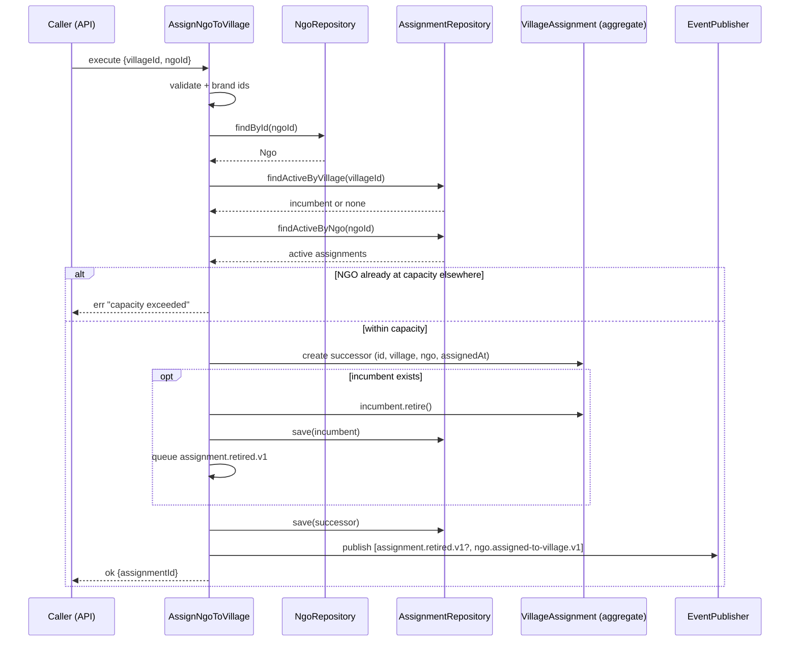
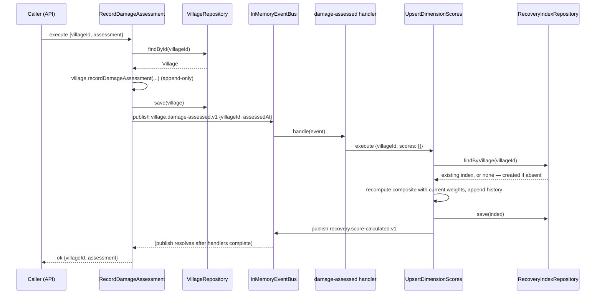
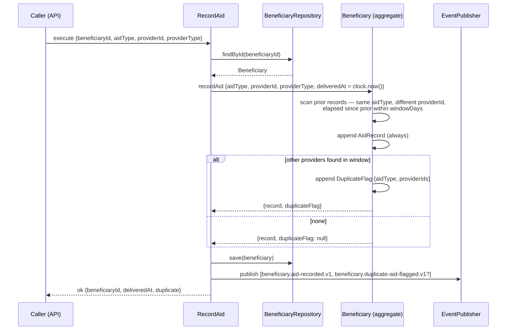
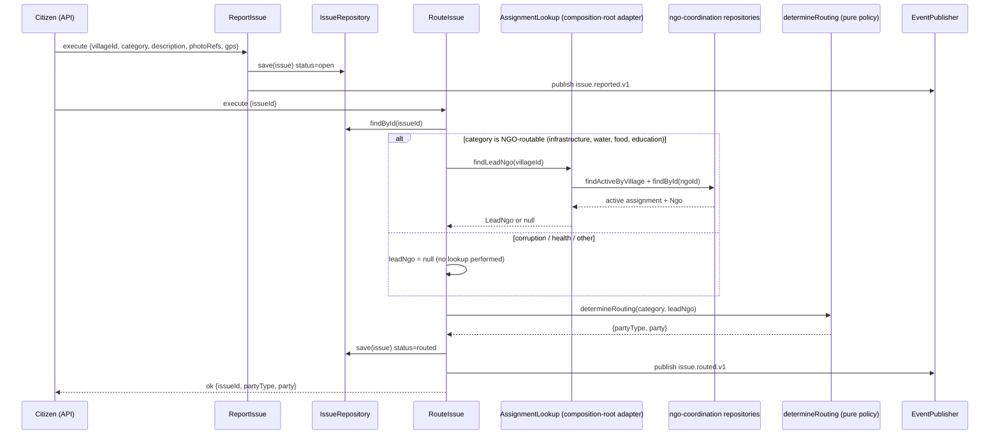

# AFRIP — System Design

**Status:** current as of the Phase 1–3 backend build (nine bounded contexts + composition root, HTTP
API and Supabase repository adapters in progress).
**Audience:** engineers extending or operating the platform.

---

## 1. Purpose & scope

This document describes **how the AFRIP platform is built**: its containers, components, domain
flows, integration mechanism, persistence design, security posture, test strategy and operational
characteristics.

It is deliberately *not*:

- a product requirements document — see [PRD.md](PRD.md) for the ubiquitous language, personas,
  bounded-context map and the phased functional requirements (F1.x / F2.x / F3.x);
- a decision log — see [adr/](adr/) for ADRs 0001–0007 and the reasoning behind hexagonal
  architecture, the TypeScript monorepo, London-school TDD, Supabase, domain events, the agent-swarm
  build and phased delivery;
- a deployment runbook — see `docs/DEPLOYMENT.md` for environment variables, provisioning and
  release steps.

Where this document and the PRD disagree, **this document describes what the code does**; §12 lists
the divergences explicitly.

Everything stated about behaviour below is traceable to code in `packages/*/src` or SQL in
`supabase/migrations/`. Sections covering the HTTP API package and the Supabase repository adapters
are kept at the architectural level, because those are under active construction — they describe the
*shape* those pieces must have (adapters implementing existing ports, REST exposure of existing use
cases), not specific routes or classes.

---

## 2. System context

### Actors

| Actor | Relationship to the system |
|---|---|
| **District officer** | Registers villages and damage assessments, sanctions and monitors funded projects, reviews anomalies and unassigned villages. Government-side authority. |
| **NGO coordinator** | Operates as the Lead NGO for assigned villages: builds the recovery committee, registers beneficiaries, records aid, works routed issues. |
| **Village committee member** | Village leadership team; reports and verifies issues, verifies completed projects, sees the village's recovery score. |
| **Citizen / donor** | Read-only consumer of the public transparency surface: recovery scores and fund flows, no beneficiary detail. |
| **Volunteer** | Registers with skills/availability/languages, is assigned to villages and tasks, logs hours. |

### External systems

| External system | Role | Coupling |
|---|---|---|
| **Supabase (Postgres + Auth + Storage)** | System of record; RLS-scoped read surface; media evidence storage referenced by `evidence_ref` / `photo_refs`. | Behind repository ports (ADR 0004). |
| **Social / news / field-report sources** | Raw text about relief activity. Never enters the domain directly — the `SignalExtractor` port translates raw text into `Extracted` value objects (anti-corruption layer). Ships with a deterministic keyword adapter; no real social API is integrated. | Behind an ACL port. |
| **Public reference data (e.g. published government datasets, public Drive exports)** | Admitted only as a bulk *source* for ingestion, never a system of record (ADR 0004). Not implemented in this build. | Ingestion port (planned). |



The four dashboards named in the PRD (district / NGO / village / public) are **not built**. The
platform currently exposes the data they would need — use cases, plus the two public SQL views — but
no UI exists.

---

## 3. Container view

Only two things run: a **Node process** serving HTTP, and **Postgres**, managed by Supabase.
Everything else in the repository is a library compiled into that process.



| Piece | Kind | Notes |
|---|---|---|
| HTTP API (`packages/api`) | **Running process** | Node 22, ESM. Root `package.json` bundles `packages/api/src/server.ts` with esbuild to `dist/server.js` (`npm run build`), started with `npm start`, and rebuilt-and-run locally with `npm run dev`. Its job is transport only: parse and validate HTTP input, call a use case, map the `Result<T>` to a status code and JSON body. Note the API cannot be run directly from TypeScript source: `node --experimental-strip-types` does not rewrite the `.js` import specifiers this codebase uses, and the dashboard is imported through an esbuild-only `.html` text loader. Both mean a build step is mandatory, hence `dev` bundles first. |
| Supabase Postgres | **Running managed service** | Schema in `supabase/migrations/`. Not yet provisioned; provisioning has a cost that requires the account owner's confirmation (ADR 0004). |
| `@afrip/platform` | Library | The composition root (`src/composition-root.ts`): constructs repositories, clock, id generators and the bus, and instantiates every use case. The single place where concrete adapters are chosen. |
| Context packages | Libraries | One npm workspace per bounded context; no build step beyond `tsc --noEmit` (ADR 0002). |
| `@afrip/shared-kernel` | Library | The only thing contexts share: `Result`, branded IDs, `Money`, the `DomainEvent` shape, the `EventPublisher` / `Clock` / `IdGenerator` ports, and test fakes (`FixedClock`, `SequentialIdGenerator`, `CapturingEventPublisher`, `InMemoryEventBus`). |
| `InMemoryEventBus` | Library object | Synchronous, in-process, per-instance. Lives in the shared kernel and is instantiated once per `createPlatform()` call. **Not** a broker — see §6 and §11. |

There is no separate worker, scheduler, queue or cache container. Anomaly detection, alert
evaluation and score recalculation are all synchronous use-case invocations, not background jobs.

---

## 4. Component view

### 4.1 Hexagonal layering (ADR 0001)

Every context package has the same three-layer shape:

```
packages/<context>/
  src/domain/       aggregates, value objects, pure policies. Imports only @afrip/shared-kernel.
  src/application/  use cases (one class per use case, with an execute() method) + ports.ts
  src/adapters/     implementations of the ports (in-memory today, Supabase in progress)
  test/             outside-in unit tests with mocked ports
```

Enforced by convention and reviewed in code:

- `domain/` never imports `application/` or `adapters/`.
- `application/` depends only on interfaces declared in its own `ports.ts` plus the shared-kernel
  ports (`EventPublisher`, `Clock`, `IdGenerator`).
- Use cases take a single `deps` object in the constructor and return `Result<T, string>` — errors
  are values, not exceptions. Nothing in the domain or application layer throws for expected failure.
- Aggregates return **copies** from their collection getters, so callers cannot mutate internal
  state (`Beneficiary.aidRecords`, `Village.damageAssessments`, `Issue.photoRefs`,
  `DevelopmentPlan.goals`, `Volunteer.assignments`).

Ports discovered so far, per context, are all narrow and client-shaped: repositories expose only the
lookups their use cases need (e.g. `AssignmentRepository` has exactly `findActiveByVillage`,
`findActiveByNgo`, `save`).

### 4.2 Contexts, aggregates, invariants and events

| Context | Aggregate root(s) | Key invariant enforced in the domain | Events published |
|---|---|---|---|
| **village-registry** (core) | `Village` | `affectedFamilies <= households` — re-validated on every demographic update, not just on create; damage assessments are append-only; severity is a closed enum. | `village.registered.v1`, `village.damage-assessed.v1`, `village.severity-updated.v1` |
| **ngo-coordination** (core) | `Ngo`, `VillageAssignment` | At most **one active assignment per village**: `AssignNgoToVillage` retires the incumbent before saving the successor, and the new assignment is fully constructed and validated *before* the incumbent is mutated, so a failure cannot leave a village with no active assignment. NGO `capacity` caps active assignments elsewhere. Committee roles are unique per assignment; retired assignments are immutable. History is never deleted. | `ngo.registered.v1`, `ngo.assigned-to-village.v1`, `assignment.retired.v1`, `committee-member.added.v1` |
| **beneficiary-registry** (core) | `Beneficiary` | Aid is **always recorded, never silently rejected**. If the same `aidType` was delivered by a *different* provider within the window (default 14 days, inclusive, looking backwards), a duplicate flag is appended alongside the aid record. Follow-ups complete once; category is a closed enum. | `beneficiary.registered.v1`, `beneficiary.aid-recorded.v1`, `beneficiary.duplicate-aid-flagged.v1`, `beneficiary.follow-up-scheduled.v1`, `beneficiary.follow-up-completed.v1` |
| **fund-monitoring** (core) | `FundedProject` | `spent <= released <= sanctioned`, enforced through `Money` (integer minor units, single currency, non-negative). Forward-only status machine `sanctioned → in_progress → completed → verified`; the first release is what moves a project to `in_progress`; expenditures are only allowed while `in_progress`. Anomaly detection is idempotent — re-running over unchanged state appends nothing. | `project.sanctioned.v1`, `project.funds-released.v1`, `project.expenditure-recorded.v1`, `project.anomaly-flagged.v1`, `project.completed.v1`, `project.verified.v1` |
| **issue-tracking** (supporting) | `Issue` | Status machine `open → routed → in_progress → resolved → verified`, each transition rejecting any other source status; resolution requires a non-empty note; GPS bounds validated. Routing itself is a **pure function** (`determineRouting`) over category + lead NGO. | `issue.reported.v1`, `issue.routed.v1`, `issue.progress-started.v1`, `issue.resolved.v1`, `issue.verified.v1` |
| **recovery-intelligence** (core) | `RecoveryIndex` (one per village) | 11 dimensions, each 0–100; `Weights` must cover all 11, be non-negative and sum to 1 (tolerance 1e-9); composite is the weighted mean rounded to the nearest integer; every recalculation appends to an append-only history. Partial score updates merge over current values and cannot be clobbered by `undefined`. | `recovery.score-calculated.v1` |
| **social-media-intelligence** (core, ACL-isolated) | `Signal`, `SmartAlert` | Raw text never reaches the domain: `SignalExtractor.extract(rawText, source)` returns a validated `Extracted` value object first. Alert rules are pure and deterministic over `Signal` + `RegistryFacts` supplied by the caller. `EvaluateAlerts` builds and validates every alert before persisting any of them, so a mid-batch failure leaves no saved alert without its event. | `signal.detected.v1`, `alert.raised.v1` |
| **volunteer-management** (supporting) | `Volunteer` | Assignment requires `availability === "available"`, checked inside the aggregate; logged hours must be `> 0` and are logged against an existing assignment only. | `volunteer.registered.v1`, `volunteer.assigned.v1`, `volunteer.hours-logged.v1`, `volunteer.availability-changed.v1` |
| **development-planning** (supporting) | `DevelopmentPlan` | One plan per village (checked by the use case via `findByVillage`); milestones belong to a goal; completion is monotonic; goal areas are a closed enum. | `plan.created.v1`, `plan.goal-added.v1`, `plan.milestone-added.v1`, `plan.milestone-completed.v1` |

### 4.3 Cross-context adaptation in the composition root

Contexts never import each other. Where one context needs a fact owned by another, it declares a
**narrow port** and the composition root supplies the adapter:

- `issue-tracking` declares `AssignmentLookup.findLeadNgo(villageId)`. The composition root
  implements it against the `ngo-coordination` repositories — that adapter is roughly ten lines and
  is the *only* place the two contexts touch.
- `ngo-coordination`'s `ListUnassignedVillages` does not query the village registry at all: the
  caller passes in the `(villageId, severity)` pairs and the use case filters and orders them. The
  cross-context join is the caller's problem, by design.
- `recovery-intelligence`'s `RecommendActions` is a pure function over caller-supplied
  `VillageSituation` records (composite, severity, `hasActiveNgo`, `daysSinceLastAid`) — it reaches
  into no other context either.

### 4.4 What the composition root currently wires

`createPlatform()` wires **five** contexts — village-registry, ngo-coordination,
recovery-intelligence, issue-tracking, beneficiary-registry — and registers **one** event
subscription: `village.damage-assessed.v1 → UpsertDimensionScores`.

fund-monitoring, volunteer-management, development-planning and social-media-intelligence are
complete, tested packages that the composition root does not yet instantiate. Wiring them (and the
additional subscriptions ADR 0005 anticipates) is outstanding work, not a design constraint.

---

## 5. Key domain flows

### 5.1 NGO reassignment retires the incumbent

The flagship invariant. Note the ordering: the successor is constructed and validated *before* the
incumbent is retired, and `assignment.retired.v1` is only published in the same batch as
`ngo.assigned-to-village.v1`.



The retirement and the new assignment are two `save` calls with no surrounding transaction. Under
the Supabase adapter this is the sharpest place where the partial unique index
`one_active_assignment_per_village` earns its keep: it makes a concurrent double-assignment fail at
the database rather than silently producing two active rows. Transactional grouping of the two
writes is an open item (§11).

### 5.2 Damage assessment → event → recovery index recalculation

The only cross-context subscription wired today.



**Be precise about what this does.** The handler passes an *empty* score map. It creates the index
if it does not exist, recomputes the composite from whatever dimension scores are already stored
using the current weights, and appends a history entry. It does **not** derive dimension scores from
the damage figures — no such mapping exists in the code. For a village with no scores yet, the
composite after a damage assessment is 0, which is exactly what the integration test asserts.
Deriving dimensions from damage data is unbuilt work, not a subtlety of the current design.

Also note that because the bus is synchronous and `publish` is awaited, a handler failure propagates
into the producing use case. Recalculation is effectively part of the assessment transaction.

### 5.3 Aid recorded → duplicate detection → flag event



The duplicate window defaults to 14 days in the domain and can be overridden per use-case instance.
Detection is scoped to a single beneficiary aggregate — it never scans across beneficiaries.
Deliveries by the *same* provider are never flagged.

### 5.4 Issue reported → routing policy → responsible party



The policy: `corruption → district_administration`; `health → health_department`;
`infrastructure | water | food | education → the village's lead NGO, or district_administration if
the village has none`; everything else → `district_administration`. Routing only succeeds from
status `open`.

---

## 6. Integration & eventing

### The contract

A domain event is exactly three fields (`packages/shared-kernel/src/events.ts`):

```ts
interface DomainEvent<TPayload = Record<string, unknown>> {
  readonly name: string;        // versioned, e.g. "village.damage-assessed.v1"
  readonly occurredAt: string;  // ISO-8601
  readonly payload: TPayload;   // primitives and identifiers only
}
```

**Naming:** `<noun>.<past-tense-verb-phrase>.v1`, lower-kebab within each segment. All 34 event names
currently emitted follow this; the `.v1` suffix is the compatibility handle — a breaking payload
change means publishing `.v2` alongside, not editing `.v1`.

**Payloads carry IDs and primitives, never aggregates.** `ngo.assigned-to-village.v1` carries
`{assignmentId, villageId, ngoId}`; `beneficiary.duplicate-aid-flagged.v1` carries
`{beneficiaryId, aidType, providerIds}`. A subscriber that needs more must ask its own context or
receive it as input — it must not reach into the publisher's tables.

### Why contexts never call each other

Direct calls or shared tables would let one context's model leak into another's, and would make
recovery-intelligence's scoring rules a hard dependency of every producer. Instead:

- Producers publish; they do not know who subscribes.
- Subscribers register handlers in the composition root, and handlers call *their own* context's use
  cases (see `makeDamageAssessedHandler`, which accepts a deliberately narrow `ScoreRecalculator`
  interface rather than the concrete use-case class).
- Where a synchronous fact is genuinely required, the consumer declares a narrow port and the
  composition root adapts it (§4.3) — still no compile-time dependency between contexts.

### Today: in-process bus. Tomorrow: outbox.

`InMemoryEventBus` is a `Map<eventName, handler[]>`; `publish` awaits each handler in registration
order, in the caller's stack, inside the caller's process. Consequences:

- Delivery is synchronous and ordered; a handler throwing propagates to the producer.
- Delivery is **per-process**. Nothing spans instances (§11).
- Nothing is durable: a crash between the repository `save` and the handler completing loses the
  reaction.

The migration path is already in the schema: `domain_events_outbox (id, name, occurred_at, payload,
published_at)` with a partial index on unpublished rows. The intended shape is an `EventPublisher`
adapter that inserts into the outbox in the same transaction as the aggregate write, plus a relay
that reads unpublished rows and dispatches them. **Neither the adapter nor the relay exists yet** —
the table is currently unused.

---

## 7. Persistence design

Schema: `supabase/migrations/00001_initial_schema.sql` (tables) and `00002_rls_policies.sql` (RLS +
public views).

### Table-per-context ownership

Every table is prefixed with its owning context (`village_registry_*`, `ngo_coordination_*`,
`beneficiary_registry_*`, `fund_monitoring_*`, `issue_tracking_*`, `volunteer_management_*`,
`recovery_intelligence_*`, `smi_*`, `development_planning_*`). Only that context's repository adapter
touches them. Cross-context SQL joins are forbidden except in the read-only public views.

Foreign keys do cross context boundaries (most context tables reference
`village_registry_villages(id)`). That is a deliberate integrity-over-purity trade: the reference is
to an *identifier*, which is exactly what contexts are allowed to share.

### Invariants mirrored as SQL constraints (defence in depth, not a replacement)

| Domain invariant | SQL counterpart |
|---|---|
| One active assignment per village | `create unique index one_active_assignment_per_village on ngo_coordination_assignments (village_id) where status = 'active'` — a **partial** unique index, so retired rows accumulate freely while only one `active` row can exist. This is the constraint that makes the non-transactional retire-then-assign sequence safe under concurrency. |
| `spent <= released <= sanctioned` | Two table-level `check` constraints on `fund_monitoring_projects` (`released_minor <= sanctioned_minor`, `spent_minor <= released_minor`) plus `>= 0` checks on all three. Amounts are `bigint` minor units, matching `Money`'s integer-minor representation. |
| `affectedFamilies <= households` | Table-level `check` on `village_registry_villages`, plus `>= 0` checks and lat/lng range checks. |
| Committee roles unique per assignment | `unique (assignment_id, role)` plus a role enum check. |
| Composite score in 0–100 | `check (composite between 0 and 100)` on both the current-index and history tables. |
| One plan per village | `village_id text not null unique` on `development_planning_plans`. |
| Closed enums (severity, category, status, aid type, fund source, alert type, …) | `check (x in (...))` on every such column. |

Every one of these duplicates a rule the domain already enforces. The domain remains authoritative;
SQL is the backstop for concurrency and for anything that bypasses the application.

### Append-only history

`village_registry_damage_assessments`, `beneficiary_registry_aid_records`,
`fund_monitoring_expenditures`, `fund_monitoring_anomalies`, `beneficiary_registry_duplicate_flags`
and `recovery_intelligence_history` are insert-only child tables — no update or delete path is
intended. This is what makes the auditability NFR achievable.

### Outbox

`domain_events_outbox` with `domain_events_outbox_unpublished` (partial index on
`published_at is null`) is the durable-delivery landing zone described in §6. Present in the schema,
not yet written to.

### Repository adapters

Each context ships an in-memory adapter today (`src/adapters/in-memory-*.ts`) used by the composition
root and every test. **Supabase repository adapters are being added per context, implementing the
same ports** — nothing above the adapter layer changes when they land: use cases keep depending on
`VillageRepository`, `AssignmentRepository`, `BeneficiaryRepository`, `ProjectRepository`,
`IssueRepository`, `RecoveryIndexRepository`, `SignalRepository`, `AlertRepository`,
`VolunteerRepository`, `PlanRepository`. Each adapter's responsibility is mapping rows to
reconstituted aggregates and back; the domain never imports the Supabase SDK.

Two mapping gaps exist between the current schema and the aggregates, and adapters will have to
either extend the schema or accept lossy reconstitution:

1. `issue_tracking_issues` stores `reported_at`, `resolved_at` and `resolution_note` but has no
   columns for the aggregate's `routedAt`, `progressStartedAt` or `verifiedAt`.
2. `fund_monitoring_projects` stores only the `released_minor` total — there is no releases table and
   no `last_released_at` column, yet `FundedProject` tracks `lastReleasedAt` and the `stalled`
   anomaly rule depends on it. A project reconstituted from the current schema cannot evaluate that
   rule.

### RLS and the four dashboards

`00002_rls_policies.sql` enables RLS on **every** table, including the outbox. Default posture is
therefore deny: with no matching policy, a table is invisible to `anon` and `authenticated`, and only
the service role (which bypasses RLS) can read or write it. Writes have no policies at all — all
writes are expected to go through the API using the service-role key.

- **District / NGO / village dashboards** — `select`-only policies for `authenticated` currently
  exist on villages, damage assessments, NGOs, assignments, fund projects, issues and recovery
  indices, all with `using (true)`. They distinguish authenticated from anonymous, but **not** one
  role from another: a village committee member and a district officer see the same rows today.
- **Beneficiary data** — the one genuinely scoped policy:
  `beneficiary_registry_beneficiaries` is readable only when an *active* assignment exists linking
  the row's village to the `ngo_id` claim in the caller's JWT. Aid records, follow-ups and duplicate
  flags have no read policy at all, so they are service-role-only.
- **Public dashboard** — two views, `public_village_recovery` (village identity, severity, composite
  score, timestamp) and `public_fund_transparency` (project, category, fund source, sanctioned /
  released / spent, status), both `grant select ... to anon`. **Neither view touches any
  beneficiary table**, so no beneficiary PII is reachable through the public surface. Because the
  views are owned by the migration role rather than declared `security_invoker`, the `grant` is what
  controls anonymous access, not the underlying table policies — that is the intent, and it means
  any future change to those view definitions is a privacy-relevant change.

---

## 8. Security model

Stated honestly: **the security model is a work in progress and should not be considered production
grade.**

### What exists

| Control | State |
|---|---|
| Transport auth | A **bearer-token stopgap** is the API package's designed posture: a shared secret carried in the `Authorization` header, checked before any use case runs. It authenticates *the caller as "an authorized system"*, nothing finer — no identity, no role, no scope. (The API package is still being built; verify the implementation matches this before relying on it.) |
| Database credentials | The Supabase **service-role key is server-side only** — held by the API process as an environment variable, never sent to a client, never embedded in a build artifact reaching a browser. The API is intended to be the only thing that speaks to Postgres. |
| RLS | Enabled on every table, deny-by-default (§7). Meaningful for any direct-to-Postgres client and as a second line of defence; largely inert for the API itself, which uses the service role and therefore bypasses it. |
| Public surface | Anonymous access is restricted to two grant-scoped views carrying no beneficiary PII. |
| Input validation | At the domain boundary: branded-ID constructors reject empty strings, aggregates validate every enum, range and non-empty constraint, and use cases return `err(...)` rather than throwing. HTTP-level parsing and shape validation is the API package's responsibility. |
| Secrets | No credentials in the repository; tests need none, because everything runs on in-memory adapters. |

### Named gaps (each is a required follow-up, not an accepted risk)

1. **No real authentication.** The bearer token is a single shared secret with no user identity, no
   expiry, no rotation story and no revocation. It must be replaced by Supabase Auth JWTs (or an
   equivalent) verified per request.
2. **No per-role authorization.** Nothing in the API or the domain currently distinguishes a district
   officer from an NGO coordinator from a village committee member. Every authenticated caller can
   invoke every use case. Role claims must be introduced and enforced — ideally at the API edge *and*
   mirrored in RLS.
3. **RLS policies are placeholders.** Six of the seven `authenticated` read policies are
   `using (true)`. Only the beneficiary policy is genuinely scoped, and it depends on an `ngo_id` JWT
   claim that nothing currently issues.
4. **Service-role bypass.** Because the API uses the service role, RLS protects against direct
   database access but not against a flaw in the API. Row scoping must therefore be enforced in the
   application layer too, or the API must adopt per-user JWTs against Postgres.
5. **No audit of who did what.** Domain events record *what changed* but carry no actor identity.
   Attribution ("which officer sanctioned this project") is not currently recoverable.
6. **No rate limiting, no request-size limits, no CORS policy** documented or implemented.
7. **Pseudonymisation is structural, not cryptographic.** Beneficiary privacy currently rests on the
   public views not selecting beneficiary tables. There is no separate pseudonymous identifier
   scheme.

---

## 9. Testing strategy

Per ADR 0003, London-school (mockist, outside-in) TDD, with Vitest (ADR 0002).

**Current suite: 536 tests across 68 files, whole-repo run in roughly 11 seconds** (`npm test`).
No database, no network, no API keys, no environment variables.

The layers of the suite:

1. **Use-case tests (the majority).** Start from the application service. Ports are mocked with
   `vi.fn()`; assertions cover both the returned `Result` and the *interactions*: what was saved, and
   which events were published with which payloads. Per ADR 0003 rule 6, the event publisher is
   always asserted — emitting the right event is part of a use case's contract, not an
   implementation detail.
2. **Aggregate / value-object tests.** State-based, direct against the domain: `Village`,
   `VillageAssignment`, `Beneficiary`, `FundedProject`, `Issue`, `RecoveryIndex`, `Weights`,
   `Signal`, `SmartAlert`, `Volunteer`, `DevelopmentPlan`, plus `Money`, `Result` and the branded-ID
   constructors. This is where invariants are pinned down, and it is the counterweight to
   over-mocking.
3. **Pure-policy tests.** `determineRouting`, `recommendActions`, `evaluateAlertRules` and the
   fund anomaly rules are pure functions and are tested as such — no doubles at all.
4. **In-memory adapter tests.** Each `InMemory*Repository` has its own test file, so the fakes used
   everywhere else are themselves verified (including the encapsulation property that stored
   aggregates are not aliased by callers).
5. **Integration test** — `packages/platform/test/integration.test.ts`, four scenarios exercising the
   real composition root over in-memory adapters end to end: NGO reassignment retiring the incumbent
   (verified both by the events and by observing that issues now route to the successor), the
   damage-assessed → recovery-index recalculation path across the bus, duplicate-aid flagging with a
   clock advanced inside the window, and issue routing to the active lead NGO.
6. **Supabase adapter tests (in progress)** — written against a **fake Supabase client** rather than
   a live database, so they stay in the same zero-infrastructure suite. They verify the adapter's
   query construction and its row-to-aggregate mapping. They are not a substitute for running the
   migrations against a real Postgres, which remains untested until a project is provisioned.

Deterministic time and identity are structural: `FixedClock` and `SequentialIdGenerator` are injected
through `PlatformOverrides`, so tests can advance time explicitly (the duplicate-aid window test
advances five days) and assert on exact identifiers.

`npm run typecheck` (`tsc --noEmit`, strict) is the second gate; there is no runtime build for the
domain packages.

---

## 10. Deployment view

- **HTTP API** — a containerized Node 22 process on a managed runtime (a container platform or a
  Node-capable PaaS). `npm run build` bundles `packages/api/src/server.ts` into a single
  `dist/server.js` with esbuild (ESM, node22 target, with a `createRequire` banner for CJS interop);
  `npm start` runs it. The bundle makes the image trivially small and removes any need to ship
  `node_modules`. The process is stateless.
- **Database** — managed Supabase Postgres. Schema is applied from `supabase/migrations/` in order,
  via `supabase db push` after `supabase link`, or file-by-file through the Supabase MCP
  `apply_migration` tool. Migrations are forward-only and reviewable in PRs.
- **Configuration** — Supabase URL and service-role key, plus the API bearer token, supplied as
  environment variables to the API process. No secret is baked into the image or the repository.
- **Environments** — the same migrations produce every environment; there is nothing environment-
  specific in the schema.

**Concrete provisioning, environment-variable names, and release steps live in
[`DEPLOYMENT.md`](DEPLOYMENT.md).** This section deliberately stops at the architectural shape.

---

## 11. Scalability, failure modes & operational concerns

### Stateless API, scale-to-zero

The API holds no session state, no cache and no locks; every request loads what it needs through a
repository and writes it back. Horizontal scaling and scale-to-zero are therefore safe *for request
handling*. Two consequences follow.

### The in-memory bus does not span instances

This is the most important operational caveat in the system. `InMemoryEventBus` is a `Map` inside one
process. With two API instances:

- an event published while handling a request on instance A is delivered **only** to handlers
  registered on instance A;
- instance B's handlers never see it, and there is no error, no retry and no log — the reaction is
  simply absent;
- because `createPlatform()` constructs a fresh bus per call, even two `Platform` instances inside a
  single process are isolated from each other.

Today the only subscription is recovery-index recalculation, so the visible symptom of running >1
instance would be *recovery indices that stop updating for a fraction of damage assessments,
silently*. Adding subscriptions without fixing this multiplies the blast radius.

**The fix is the outbox**, and it is already designed for: write the event to `domain_events_outbox`
in the same transaction as the aggregate, and have a relay claim unpublished rows and dispatch them.
That converts delivery from "whoever happens to share this process" to "at-least-once, durable,
instance-independent" — and requires handlers to become idempotent, which most already are in spirit
(`detectAnomalies` deduplicates findings; `upsertScores` is a recompute). Until the outbox adapter
and relay exist, **run exactly one API instance.**

### Synchronous publish couples producer and subscriber

`publish` awaits every handler. A slow or failing handler slows or fails the originating request:
recording a damage assessment currently also performs a recovery-index read, recompute and write
before it returns. This is acceptable at present volumes and has the benefit of making the reaction
transactional-ish, but it means handler latency is user-visible latency.

### No transactions across aggregates

Nothing in the codebase opens a transaction. Multi-write use cases — `AssignNgoToVillage` (retire +
save) and `EvaluateAlerts` (n alert saves) — are sequences of independent writes. Both mitigate this
by validating everything before the first write, so a failure is far more likely to occur before any
mutation than between two. For reassignment, the partial unique index provides the concurrency
guarantee. Once Supabase adapters land, wrapping these sequences in a single transaction (or an RPC)
should be revisited.

### Cold starts

Scale-to-zero on a managed runtime means the first request after idle pays process start plus
Supabase connection setup. The bundled artifact keeps the JS side small. The domain layer has no
warm-up cost. If cold-start latency matters for citizen-facing issue reporting, pin a minimum
instance count — which, note, interacts with the single-instance constraint above.

### Backup and restore

Delegated to managed Postgres point-in-time recovery. Two properties make restore relatively benign:
the schema is forward-only migrations under version control, and the write-heavy tables are
append-only, so a point-in-time restore loses recent records rather than corrupting historical ones.
There is no application-level backup, export or replay mechanism; when the outbox is in use it will
need a retention policy of its own.

### Observability

There is none beyond process logs. No structured logging, metrics, tracing or alerting is
implemented. Domain events would be the natural spine for an audit log and for operational metrics
once they are durable.

---

## 12. Known limitations & roadmap

### Deliberately out of scope in this build (PRD §7, ADR 0007)

| Not built | Note |
|---|---|
| Four dashboards / any UI (PRD F3.6) | The read side exists as use cases and two public SQL views; no client. |
| Native mobile apps, offline capture, QR beneficiary verification (PRD F3.7) | Explicitly deferred; the append-only aid model is sync-friendly but no sync protocol exists. |
| Real social-media / news API integrations (PRD F3.2) | The `SignalExtractor` port ships with a deterministic keyword adapter only. The ACL exists precisely so a real extractor is a drop-in. |
| GIS map rendering | Villages and issues store lat/lng; nothing renders them. |
| Payment rails, satellite/drone imagery | Out of scope. |
| Google Drive / public-dataset ingestion | Permitted by ADR 0004 as a bulk source; no ingestion port implemented. |

### Built but not yet wired or finished

| Gap | Impact |
|---|---|
| Composition root wires 5 of 9 contexts | fund-monitoring, volunteer-management, development-planning and social-media-intelligence are fully tested packages with no entry point into the running platform. |
| One event subscription exists | ADR 0005 anticipates recovery-intelligence reacting to aid, fund and issue events. Only `village.damage-assessed.v1` is subscribed. |
| Damage → dimension-score mapping | The damage-assessed handler triggers a recalculation with an empty score map; it does not derive dimension scores from damage figures (§5.2). Until that mapping is written, PRD F2.8's "recompute index on relevant events" is satisfied only in mechanism, not in substance. |
| Outbox unused | Table and index exist; no publisher adapter, no relay. This is what caps the platform at one instance (§11). |
| HTTP API | Under construction; transport-only by design. |
| Supabase repository adapters | Under construction; two schema/aggregate mapping gaps to resolve first (§7). |
| Migrations never run | No Supabase project is provisioned, so the SQL has never been executed. Treat it as unverified until it is. |
| Real auth and per-role scoping | §8, gaps 1–3. The single largest gap before any real deployment. |

### Divergences between the documentation and the code

Recorded so the next reader is not misled:

- **Event names.** PRD §3.3 lists events in PascalCase concept form (`VillageRegistered`,
  `NgoAssignedToVillage`, `SmartAlertRaised`, `RecoveryScoreCalculated`). The code — and the actual
  published language — uses `<noun>.<past-tense>.v1` (`village.registered.v1`,
  `ngo.assigned-to-village.v1`, `alert.raised.v1`, `recovery.score-calculated.v1`). The code is
  authoritative.
- **`VillageProfileUpdated`** appears in the PRD but is emitted nowhere. `Village.updateDemographics`
  exists on the aggregate with full re-validation, but no use case calls it and no event is
  published. What ships instead is `village.severity-updated.v1`.
- **PRD `FollowUpCompleted` / `HoursLogged`** correspond to `beneficiary.follow-up-completed.v1` and
  `volunteer.hours-logged.v1`; the registry also emits `beneficiary.follow-up-scheduled.v1` and
  volunteer-management also emits `volunteer.availability-changed.v1`, neither of which the PRD
  lists.
- **Table prefix convention.** ADR 0004 says tables are prefixed per context; social-media-
  intelligence uses `smi_` rather than a full context prefix. Cosmetic, but inconsistent.
- **`ListUnassignedVillages`** is described in the PRD (F1.7) as "list unassigned villages ordered by
  severity", which reads like a query over the village registry. In the code the caller supplies the
  `(villageId, severity)` pairs and the use case filters and sorts them — a context-boundary
  decision, and a real constraint on whoever builds the district dashboard.
- **NGO-routable categories are duplicated.** The list `["infrastructure","water","food","education"]`
  appears both in `issue-tracking/src/domain/routing-policy.ts` and in
  `issue-tracking/src/application/route-issue.ts` (used to decide whether to perform the lead-NGO
  lookup). They agree today; they are two places that must change together.
