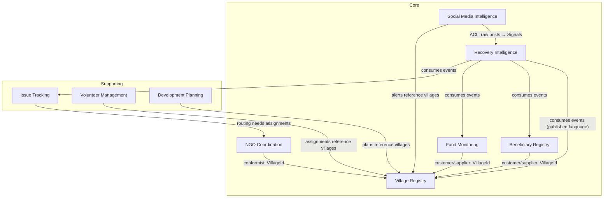

# AFRIP — Product Requirements Document (Domain-Driven Design)

**Product:** AI-Powered Flood Recovery & Village Development Intelligence Platform (AFRIP)
**Source:** AFRIP Concept & Visual Design Document
**Approach:** Domain-Driven Design (strategic + tactical), delivered phase-wise with London-school TDD
**Status:** v1.0 — baseline for Phase 1–3 implementation

---

## 1. Vision & Problem Statement

Build a platform that does not stop after flood relief: it becomes the operating system for the
long-term recovery and development of every affected village, covering the full journey
**Recovery → Rehabilitation → Accountability → Development**.

### The problem
During floods, hundreds of NGOs, volunteers, donors and government agencies work independently.
After 30–60 days:

- Nobody knows which village received what; some villages receive duplicate aid, some receive nothing.
- Orphaned children disappear from records; widows receive no follow-up.
- Government funds cannot be tracked; village committees dissolve; NGOs leave without monitoring.

### The gap (from competitive research)
Spectee Pro, RiskMap, Global Flood Monitor, PetaBencana, DASTAA, GeoThings and Relific each cover a
slice (social-media AI, crowdsourced mapping, NGO dashboards). **None provide a village-level
recovery operating system** combining AI-driven social-media extraction, beneficiary management,
NGO assignment, government fund monitoring and long-term development planning.

### Core philosophy
**One Village → One NGO → One Village Leadership Team.** Every affected village has an assigned
lead NGO, a Village Recovery Committee, volunteers, a government representative, a health worker,
a school representative and a women's representative — all continuously tracked.

---

## 2. Ubiquitous Language

| Term | Meaning |
|---|---|
| **Village** | The unit of recovery. Has a digital profile: demographics, damage, infrastructure, committee, assigned NGO, recovery score. |
| **Damage Assessment** | Recorded impact on a village: houses, schools, health centres, water sources, agriculture, livestock. |
| **Severity** | Flood impact classification of a village: `minor`, `moderate`, `severe`, `critical`. |
| **Beneficiary** | A vulnerable person/household on the registry: widow, orphan, senior citizen, disabled person, pregnant woman, farmer, small business, daily-wage worker, student. |
| **Aid Record** | A dated, typed record of aid delivered to a beneficiary (food, shelter, medical, cash, livelihood…), with source (NGO/government/donor). |
| **Duplicate Aid** | Aid of the same type delivered to the same beneficiary by different providers within a suspicion window — flagged, never silently rejected. |
| **Follow-up** | A scheduled or completed check on a beneficiary's current status. |
| **Lead NGO** | The single NGO assigned to a village under One-Village-One-NGO. |
| **Village Assignment** | The binding of a Lead NGO + leadership team to a village. Only one *active* assignment per village. |
| **Recovery Committee** | The village leadership team: leader, volunteer, engineer, teacher, doctor, government rep, women's rep. |
| **Funded Project** | A budgeted intervention in a village (bridge, school repair, water supply) with sanctioned / released / spent amounts and geo-tagged evidence. |
| **Fund Anomaly** | An AI/rule flag on a funded project: delayed, duplicate funding, overspend vs. comparable work. |
| **Issue** | A citizen-reported problem (broken bridge, no drinking water, closed school, corruption) with photos + GPS, categorized and routed. |
| **Routing** | Assigning an issue to the responsible NGO or government department based on its category. |
| **Volunteer** | A registered helper with skills, availability, location, languages; assigned to villages/tasks; hours tracked. |
| **Recovery Index / Village Health Score** | Composite 0–100 index across 11 dimensions: infrastructure, education, health, livelihood, agriculture, housing, employment, water, sanitation, road, electricity. |
| **Signal** | A piece of external intelligence (social post, news item, field report) extracted by AI: village, activity, needs, entities. |
| **Smart Alert** | An actionable alert derived from signals/state: "new relief activity detected", "duplicate aid likely", "no NGO assigned", "possible orphan identified", "medical support needed". |
| **Development Plan** | The long-term (post-relief) plan for a village: goals and milestones across education, livelihood, health, infrastructure. |

---

## 3. Strategic Design

### 3.1 Domain classification

| Subdomain | Type | Rationale |
|---|---|---|
| Village Registry | **Core** | The village digital profile is the platform's backbone. |
| NGO Coordination (One-Village-One-NGO) | **Core** | The distinctive accountability model. |
| Beneficiary Registry | **Core** | Duplicate-aid detection & vulnerable-person tracking is the key differentiator. |
| Fund Monitoring | **Core** | Transparency/anomaly detection over public money. |
| Recovery Intelligence (health score + recommendations) | **Core** | The "AI" in AFRIP; drives prioritization. |
| Social Media Intelligence | **Core** (ACL-isolated) | High value, high volatility — isolated behind an anti-corruption layer. |
| Issue Tracking | Supporting | Standard ticket-like workflow with domain routing rules. |
| Volunteer Management | Supporting | Registration/assignment/hours; commodity workflow. |
| Development Planning | Supporting | Long-horizon goal/milestone tracking. |
| Identity & Access, Notifications, Media Storage, GIS base maps | Generic | Buy/reuse (Supabase Auth/Storage, map tiles). |

### 3.2 Bounded contexts & context map

**Integration rules**

- Contexts share **identifiers only** (`VillageId`, `NgoId`, `BeneficiaryId`) — never entities.
- Cross-context communication is via **domain events** (published language) dispatched through an
  event bus port; no context queries another's tables.
- **Social Media Intelligence** wraps volatile external feeds behind an **anti-corruption layer**:
  raw posts are translated into `Signal` value objects before anything downstream sees them. The AI
  extractor/classifier is a **port** (mockable; swappable between providers).

### 3.3 Aggregates, invariants & domain events

| Context | Aggregate (root) | Key invariants | Emits |
|---|---|---|---|
| Village Registry | **Village** | affected families ≤ households; severity from enum; damage assessment append-only | `VillageRegistered`, `DamageAssessed`, `VillageProfileUpdated` |
| NGO Coordination | **Ngo**, **VillageAssignment** | ≤ 1 *active* assignment per village; committee roles unique per assignment; reassignment retires prior assignment | `NgoRegistered`, `NgoAssignedToVillage`, `AssignmentRetired`, `CommitteeMemberAdded` |
| Beneficiary Registry | **Beneficiary** | valid vulnerability category; aid append-only; same aid type from a different provider within window ⇒ flag (never silent-drop) | `BeneficiaryRegistered`, `AidRecorded`, `DuplicateAidFlagged`, `FollowUpCompleted` |
| Fund Monitoring | **FundedProject** | released ≤ sanctioned; spent ≤ released; status machine `sanctioned → in_progress → completed → verified`; overspend/durations ⇒ anomaly | `ProjectSanctioned`, `FundsReleased`, `ExpenditureRecorded`, `ProjectAnomalyFlagged`, `ProjectCompleted`, `ProjectVerified` |
| Issue Tracking | **Issue** | must have category + village; status machine `open → routed → in_progress → resolved → verified`; routing derives responsible party from category | `IssueReported`, `IssueRouted`, `IssueResolved`, `IssueVerified` |
| Volunteer Management | **Volunteer** | assignment requires availability; hours ≥ 0 logged against assignments only | `VolunteerRegistered`, `VolunteerAssigned`, `HoursLogged` |
| Recovery Intelligence | **RecoveryIndex** (per village) | 11 dimension scores 0–100; composite = weighted mean; weights sum to 1 | `RecoveryScoreCalculated` |
| Social Media Intelligence | **Signal**, **SmartAlert** | signal requires source + extracted content; alert rules deterministic over signals + registry state | `SignalDetected`, `SmartAlertRaised` |
| Development Planning | **DevelopmentPlan** | milestones belong to a goal; completion is monotonic | `PlanCreated`, `MilestoneCompleted` |

---

## 4. Personas & Stakeholder Views

| Persona | Needs (dashboard) |
|---|---|
| **District Officer** | District dashboard: severity map, fund utilization, anomalies, unassigned villages. |
| **NGO Coordinator** | NGO dashboard: assigned villages, projects, budget, beneficiaries, pending work. |
| **Village Committee Member** | Village dashboard: profile, recovery score, issues, aid received, meetings. |
| **Citizen / Donor** | Public transparency dashboard: read-only recovery progress and fund flows. |
| **Volunteer** | Registration, assignments, hours, certificates. |

---

## 5. Functional Requirements (by phase)

### Phase 1 — Foundations: "Every village visible, every village owned" (Core MVP)
| ID | Requirement | Context |
|---|---|---|
| F1.1 | Register a village with location, admin region, demographics | Village Registry |
| F1.2 | Record damage assessments (houses, schools, health, water, agriculture, livestock) | Village Registry |
| F1.3 | Classify/update village severity | Village Registry |
| F1.4 | Register NGOs with capacity and focus areas | NGO Coordination |
| F1.5 | Assign exactly one active lead NGO to a village; reassignment retires previous | NGO Coordination |
| F1.6 | Build a recovery committee (unique roles) on an assignment | NGO Coordination |
| F1.7 | List unassigned villages ordered by severity | NGO Coordination |
| F1.8 | Register beneficiaries with vulnerability category and village | Beneficiary Registry |
| F1.9 | Record aid deliveries; flag likely duplicates (same type, different provider, within window) | Beneficiary Registry |
| F1.10 | Record follow-ups; list beneficiaries overdue for follow-up | Beneficiary Registry |

### Phase 2 — Accountability: "Every rupee and every complaint traceable"
| ID | Requirement | Context |
|---|---|---|
| F2.1 | Sanction a funded project for a village (source: district/CSR/NGO/donor/MLA/MP funds) | Fund Monitoring |
| F2.2 | Record fund releases and expenditures with evidence refs; enforce spent ≤ released ≤ sanctioned | Fund Monitoring |
| F2.3 | Flag anomalies: overspend vs. comparable projects, stalled projects, duplicate funding for same work | Fund Monitoring |
| F2.4 | Report an issue with category, photos, GPS | Issue Tracking |
| F2.5 | Auto-route issues to responsible NGO/department by category | Issue Tracking |
| F2.6 | Resolve + verify issues; villagers can verify resolution | Issue Tracking |
| F2.7 | Compute Village Recovery Index across 11 dimensions with configurable weights | Recovery Intelligence |
| F2.8 | Recompute index on relevant events; expose score history | Recovery Intelligence |

### Phase 3 — Intelligence & Scale: "The platform that never leaves"
| ID | Requirement | Context |
|---|---|---|
| F3.1 | Register volunteers (skills, availability, languages); assign; log hours | Volunteer Management |
| F3.2 | Ingest external signals via AI extractor port (social, news, field reports) | Social Media Intelligence |
| F3.3 | Raise smart alerts: relief activity detected, duplicate aid likely, no NGO assigned, possible orphan, medical need | Social Media Intelligence |
| F3.4 | Recommendations: urgent villages, ignored villages, funding gaps, priority projects | Recovery Intelligence |
| F3.5 | Create long-term development plans with goals/milestones per village | Development Planning |
| F3.6 | Four dashboards (district, NGO, village, public) as read projections | (projections) |
| F3.7 | Offline-capable mobile capture with sync, QR beneficiary verification | (apps; out of scope for backend MVP) |

---

## 6. Non-Functional Requirements

- **Auditability** — every aggregate change captured as a domain event; append-only aid/expenditure records.
- **Testability** — all I/O behind ports; London-school TDD; domain logic 100% unit-testable without infrastructure.
- **Data store** — Supabase (Postgres) as the primary store via repository adapters; Row-Level Security for role-scoped dashboards; publicly accessible Google Drive acceptable as a public *source* for bulk/reference data ingestion where APIs are unavailable.
- **Extensibility** — reusable for earthquakes, cyclones, landslides: disaster type is data, not code.
- **Transparency** — public read projections never expose personally identifying beneficiary detail (IDs are pseudonymised).
- **Localization-ready** — user-facing strings isolated; local language interfaces planned for mobile.

## 7. Out of Scope (this build)

- Native mobile apps, GIS map rendering, real social-media API integrations (the extractor port ships with a deterministic fake), payment rails, satellite/drone imagery processing.

## 8. Success Metrics

- 0 villages with > severity `moderate` unassigned to an NGO after 14 days.
- 100% of aid records attributable to provider + date; duplicate-aid flags reviewed within 7 days.
- 100% of funded projects with sanctioned/released/spent visible publicly.
- Recovery index computed for every registered village, refreshed on every relevant event.
