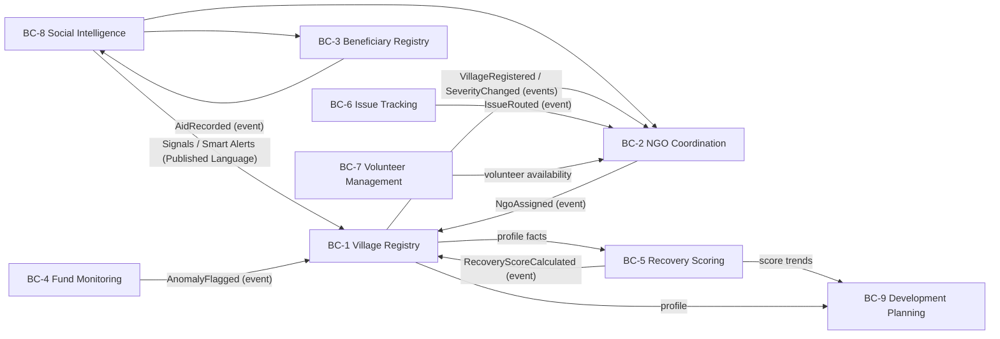

# AFRIP — Product Requirements Document (Domain-Driven Design)

**Product:** AI-Powered Flood Recovery & Village Development Intelligence Platform (AFRIP)
**Source:** AFRIP Concept & Visual Design Document
**Approach:** Domain-Driven Design (strategic + tactical), Hexagonal Architecture, TDD (London School)
**Status:** Approved for phased build
**Date:** 2026-07-28

---

## 1. Vision

Build an AI-powered platform that does not stop after flood relief. AFRIP becomes the
operating system for the long-term recovery and development of every affected village,
covering the full journey: **Recovery → Rehabilitation → Accountability → Development**.

Core philosophy: **One Village → One NGO → One Village Leadership Team.** Every affected
village has an assigned lead NGO, a Village Recovery Committee, volunteers, a government
representative, a health worker, a school representative and a women's representative —
all continuously tracked.

### 1.1 Problem

During floods, hundreds of NGOs, volunteers, donors and government agencies work
independently. After 30–60 days:

- Nobody knows which village received what; some villages receive duplicate aid, some none.
- Orphaned children disappear from records; widows receive no follow-up.
- Government funds cannot be tracked; village committees dissolve; NGOs leave without
  long-term monitoring.

### 1.2 Differentiation (from concept research)

Spectee Pro, RiskMap, Global Flood Monitor, PetaBencana, DASTAA, GeoThings and Relific each
solve one slice. **None provide a village-level recovery operating system** combining AI
social-media extraction, beneficiary management, NGO assignment, government fund monitoring
and long-term development planning. That combination is AFRIP's core domain.

---

## 2. Stakeholders & Personas

| Persona | Goals | Primary views |
|---|---|---|
| District Administrator | Situation awareness, fund oversight, no village left behind | District dashboard, fund monitor |
| NGO Coordinator | Claim/receive village assignment, report projects & spend | NGO dashboard, project updates |
| Village Committee Member | Report issues, verify aid, track village recovery | Village dashboard, issue tracker |
| Volunteer | Register skills, receive assignments, log hours | Mobile app |
| Donor / CSR Officer | Verify funds reached villages, see impact | Public transparency dashboard |
| Citizen / Villager | Report needs & grievances with photo + GPS | Mobile app (offline-capable) |
| Vulnerable beneficiary (widow, orphan guardian, disabled, farmer…) | Receive aid, benefits and follow-ups without falling out of records | Beneficiary registry (via field workers) |

---

## 3. Ubiquitous Language (Glossary)

| Term | Meaning |
|---|---|
| **Village** | The unit of recovery. Has a Digital Profile, a Severity, an assigned NGO and a Recovery Score. |
| **Digital Profile** | The living record of a village: population, households, affected families, damage inventory, schemes, committee, media evidence. |
| **Severity** | Flood impact classification of a village: `unaffected`, `low`, `moderate`, `severe`, `critical`. |
| **Assignment** | The binding of exactly one lead NGO to one village (One Village, One NGO). |
| **Leadership Team** | Village Recovery Committee roles: leader, volunteer, engineer, teacher, doctor, government rep, women's rep. |
| **Beneficiary** | A registered vulnerable person/household: widow, orphaned child, senior citizen, disabled person, pregnant woman, farmer, small business, daily-wage worker, student. |
| **Aid Event** | A recorded delivery of relief/support to a beneficiary or village (who, what, when, by whom, evidence). |
| **Duplicate Aid** | Two Aid Events of the same kind to the same target within a suspicion window. |
| **Follow-up** | A scheduled re-check on a beneficiary; overdue follow-ups are a first-class alert. |
| **Project** | An NGO or government funded work item in a village with budget sanctioned/released/spent and geo-tagged evidence. |
| **Fund Anomaly** | AI/rule-flagged irregularity: delayed project, duplicate funding, overspend vs. comparable work. |
| **Recovery Score** | Composite 0–100 index across infrastructure, education, health, livelihood, agriculture, housing, employment, water, sanitation, road, electricity. |
| **Issue** | A citizen-reported problem (damaged bridge, no water, closed school, corruption…) with photos + GPS, categorized and routed. |
| **Routing** | Assigning an Issue to the responsible NGO or government department based on category. |
| **Signal** | A social-media/news item the AI extracted (village, activity, needs, orphan sighting…). |
| **Smart Alert** | Actionable notification derived from signals/rules: "Duplicate aid likely", "No NGO assigned", "Possible orphan identified", "Medical support needed". |
| **Volunteer** | Registered helper with skills, availability, location, languages; earns hours and certificates. |
| **Development Plan** | Post-relief long-term plan: schools, roads, employment, healthcare, women's groups, skills, microfinance. |

---

## 4. Strategic Design — Bounded Contexts

AFRIP's twelve concept modules map onto nine bounded contexts plus presentation layers.

### 4.1 Context inventory

| # | Bounded Context | Type | Concept modules covered |
|---|---|---|---|
| BC-1 | **Village Registry** | Core | 1. Disaster Map, 2. Village Digital Profile |
| BC-2 | **NGO Coordination** | Core | 5. NGO Coordination, 6. One Village One NGO |
| BC-3 | **Beneficiary Registry** | Core | 4. Beneficiary Registry |
| BC-4 | **Fund Monitoring** | Core | 7. Government Fund Monitoring |
| BC-5 | **Recovery Scoring** | Core | 8. AI Village Health Score |
| BC-6 | **Issue Tracking** | Supporting | 9. Issue Tracking |
| BC-7 | **Volunteer Management** | Supporting | 10. Volunteer Management |
| BC-8 | **Social Intelligence** | Core (AI) | 3. AI Social Media Intelligence, 11. AI Recommendation Engine |
| BC-9 | **Development Planning** | Supporting | 12. Long-Term Village Development Planner |
| — | Dashboards / Mobile App | Presentation | District, NGO, Village, Public views; offline mobile |

### 4.2 Context map (relationships)

Relationship styles:

- **Shared Kernel:** tiny set of identity types and domain primitives (`VillageId`, `NgoId`,
  `BeneficiaryId`, `Money`, `GeoPoint`, `Result`, `DomainEvent`) shared by all contexts.
- **Customer/Supplier:** Village Registry supplies village facts to Recovery Scoring and
  Development Planning.
- **Published Language:** Social Intelligence publishes `Signal` and `SmartAlert` schemas;
  downstream contexts consume via anti-corruption mappers.
- **Conformist:** Dashboards conform to context read models (no upstream influence).
- **Open Host Service:** each context exposes its application services (use cases) as ports;
  Supabase adapters and HTTP/API adapters plug in at the infrastructure layer.

### 4.3 Integration principle

Contexts communicate through **domain events** (asynchronous, at-least-once) and never by
reaching into another context's tables. Event names are past tense and part of the
ubiquitous language: `VillageRegistered`, `SeverityChanged`, `NgoAssigned`,
`BeneficiaryRegistered`, `AidRecorded`, `DuplicateAidSuspected`, `FollowUpOverdue`,
`ProjectFunded`, `ExpenditureRecorded`, `AnomalyFlagged`, `RecoveryScoreCalculated`,
`IssueReported`, `IssueRouted`, `IssueResolved`, `VolunteerRegistered`,
`VolunteerAssigned`, `SignalExtracted`, `SmartAlertRaised`.

---

## 5. Tactical Design — Aggregates, Invariants, Events

### BC-1 Village Registry (Core)

- **Aggregate:** `Village` (root). Value objects: `VillageId`, `GeoPoint`, `Severity`,
  `DamageInventory` (houses, schools, health centres, water sources, agriculture,
  livestock), `Demographics` (population, households, affectedFamilies).
- **Invariants:**
  - A village must have a name, district and location to be registered.
  - `affectedFamilies ≤ households`; damage counts are non-negative.
  - Severity transitions are recorded with timestamp and reason (audit trail).
- **Events:** `VillageRegistered`, `SeverityChanged`, `ProfileUpdated`.
- **Ports (driven):** `VillageRepository`, `EventPublisher`, `Clock`.

### BC-2 NGO Coordination (Core)

- **Aggregates:** `Ngo` (capacity, verified status), `VillageAssignment` (root for the
  One-Village-One-NGO binding), `LeadershipTeam`.
- **Invariants (the heart of the platform):**
  - **At most one active lead NGO per village** (One Village, One NGO).
  - An NGO cannot be assigned beyond its declared capacity.
  - Only verified NGOs can be assigned.
  - Reassignment requires releasing the previous assignment (with reason) first.
  - A LeadershipTeam requires a leader; the seven roles are each held by at most one person.
- **Events:** `NgoRegistered`, `NgoVerified`, `NgoAssigned`, `AssignmentReleased`,
  `LeadershipTeamFormed`.
- **Ports:** `NgoRepository`, `AssignmentRepository`, `EventPublisher`.

### BC-3 Beneficiary Registry (Core)

- **Aggregate:** `Beneficiary` (root). VOs: `VulnerabilityCategory`, `NeedsList`,
  `AidEvent`, `FollowUpSchedule`.
- **Invariants:**
  - A beneficiary has ≥1 vulnerability category and a village.
  - Aid events are append-only (immutable audit history).
  - **Duplicate aid detection:** same aid kind to same beneficiary within the suspicion
    window (default 7 days) raises `DuplicateAidSuspected` — record is kept, alert raised.
  - Orphaned children and widows must always have a next follow-up date; a missing or past
    follow-up beyond grace raises `FollowUpOverdue` ("no one disappears from records").
- **Events:** `BeneficiaryRegistered`, `AidRecorded`, `DuplicateAidSuspected`,
  `FollowUpCompleted`, `FollowUpOverdue`.
- **Ports:** `BeneficiaryRepository`, `EventPublisher`, `Clock`.

### BC-4 Fund Monitoring (Core)

- **Aggregate:** `FundedProject` (root). VOs: `Money` (integer minor units, currency),
  `BudgetLedger` (sanctioned ≥ released ≥ spent), `EvidenceItem` (geo-tagged photo,
  invoice, completion certificate, village verification).
- **Invariants:**
  - `released ≤ sanctioned`; `spent ≤ released` (cannot spend unreleased funds).
  - Every expenditure needs an amount > 0 and a description; evidence is append-only.
  - Completion requires village verification evidence.
- **Anomaly rules (domain service `AnomalyDetector`):**
  - *Delayed:* past expected completion date and not complete.
  - *Duplicate funding:* two projects of the same category in the same village with
    overlapping periods.
  - *Overspend:* spend per unit > configurable multiplier (default 1.5×) of the median of
    comparable projects.
- **Events:** `ProjectFunded`, `FundsReleased`, `ExpenditureRecorded`, `EvidenceAttached`,
  `ProjectCompleted`, `AnomalyFlagged`.
- **Ports:** `ProjectRepository`, `ComparableProjectsQuery`, `EventPublisher`, `Clock`.

### BC-5 Recovery Scoring (Core)

- **Aggregate:** `VillageScorecard` (root) holding an immutable score history.
- **VOs:** `CategoryScore` (category ∈ {infrastructure, education, health, livelihood,
  agriculture, housing, employment, water, sanitation, road, electricity}, value 0–100),
  `RecoveryScore` (weighted composite, rounded, 0–100).
- **Invariants:**
  - All 11 categories are required to compute; weights sum to 1.0.
  - Score history is append-only; trend = latest − previous.
- **Events:** `RecoveryScoreCalculated`.
- **Ports:** `ScorecardRepository`, `EventPublisher`, `Clock`.

### BC-6 Issue Tracking (Supporting)

- **Aggregate:** `Issue` (root). VOs: `IssueCategory` (infrastructure, water, education,
  health, food, corruption, other), `Attachment` (photo + GPS), `RoutingDecision`.
- **Invariants:**
  - An issue requires a village, a category, a description and reporter contact.
  - Status machine: `reported → routed → in_progress → resolved | rejected`
    (no skipping; rejection requires a reason).
  - **Routing policy:** corruption → district administration (never the NGO);
    others → assigned NGO if present, else district department for that category.
- **Events:** `IssueReported`, `IssueRouted`, `IssueResolved`, `IssueRejected`.
- **Ports:** `IssueRepository`, `AssignmentLookup` (ACL onto BC-2), `EventPublisher`, `Clock`.

### BC-7 Volunteer Management (Supporting)

- **Aggregate:** `Volunteer` (root). VOs: `SkillSet`, `Availability`, `AssignmentRecord`,
  `ServiceLog`.
- **Invariants:**
  - Registration requires name, contact, ≥1 skill, ≥1 language, location.
  - A volunteer holds at most one active assignment at a time.
  - Hours are logged against an assignment, positive, append-only; certificates issue at
    configurable hour thresholds (default 50h).
- **Events:** `VolunteerRegistered`, `VolunteerAssigned`, `HoursLogged`,
  `CertificateEarned`.
- **Ports:** `VolunteerRepository`, `EventPublisher`, `Clock`.

### BC-8 Social Intelligence (Core, AI)

- **Aggregates:** `Signal` (extracted item with provenance + confidence), `SmartAlert`.
- **Invariants:** every signal keeps source, timestamp, confidence ∈ [0,1]; alerts reference
  ≥1 signal or rule; alerts are acknowledged, never deleted.
- **Ports:** `SignalSource` (social APIs, news, field reports), `Extractor` (LLM),
  `AlertRepository`, `EventPublisher`.
- *Phase note:* interfaces and domain model in Phase 2; live extraction pipelines are
  post-MVP (external API access, moderation and rate limits are open questions).

### BC-9 Development Planning (Supporting)

- **Aggregate:** `DevelopmentPlan` (root) with `Initiative` entities (school, road,
  employment, healthcare, women's group, youth club, skills, microfinance…).
- **Invariants:** one active plan per village; initiatives have target dates and owners;
  progress is milestone-based.
- **Events:** `PlanCreated`, `InitiativeAdded`, `MilestoneReached`.
- *Phase note:* post-MVP; modeled, not built, in the first release.

---

## 6. Functional Requirements (by context)

FR-IDs are stable and referenced from tests.

**Village Registry**
- FR-VR-1 Register a village with name, district, geo-location, demographics.
- FR-VR-2 Update the damage inventory with non-negative counts.
- FR-VR-3 Change severity with reason; keep full audit history.
- FR-VR-4 Query villages by district and severity (map/dashboard read model).

**NGO Coordination**
- FR-NC-1 Register and verify NGOs with capacity.
- FR-NC-2 Assign exactly one lead NGO to a village; reject a second active assignment.
- FR-NC-3 Release an assignment with reason; allow reassignment afterwards.
- FR-NC-4 Enforce NGO capacity across its active assignments.
- FR-NC-5 Form a leadership team (leader mandatory, one person per role).
- FR-NC-6 List unassigned affected villages ("No NGO assigned" alert feed).

**Beneficiary Registry**
- FR-BR-1 Register beneficiaries with categories, village, needs.
- FR-BR-2 Record aid events (append-only) with provider and kind.
- FR-BR-3 Detect duplicate aid within the suspicion window and raise an alert.
- FR-BR-4 Schedule and complete follow-ups; surface overdue follow-ups for widows/orphans.

**Fund Monitoring**
- FR-FM-1 Create funded projects with sanctioned budget and funding source.
- FR-FM-2 Record releases and expenditures respecting the ledger invariants.
- FR-FM-3 Attach geo-tagged evidence; complete only with village verification.
- FR-FM-4 Flag anomalies: delayed, duplicate funding, comparative overspend.

**Recovery Scoring**
- FR-RS-1 Compute the composite Recovery Score from 11 category scores with weights.
- FR-RS-2 Persist score history; expose trend (improving/declining).
- FR-RS-3 Reject incomplete category sets or invalid weights.

**Issue Tracking**
- FR-IT-1 Report an issue with village, category, description, photos + GPS.
- FR-IT-2 Route automatically per routing policy (corruption → district admin).
- FR-IT-3 Progress the status machine; resolve or reject (reason required).

**Volunteer Management**
- FR-VM-1 Register volunteers with skills, availability, languages, location.
- FR-VM-2 Assign a volunteer (single active assignment) and track it.
- FR-VM-3 Log hours; issue certificates at thresholds; leaderboard read model.

**Social Intelligence** *(interfaces in MVP, pipeline post-MVP)*
- FR-SI-1 Ingest signals with provenance and confidence.
- FR-SI-2 Raise smart alerts ("Duplicate aid likely", "No NGO assigned", "Possible orphan
  identified", "Medical support needed") from signals and cross-context events.

---

## 7. Non-Functional Requirements

- **NFR-1 Auditability:** aid, funds and severity changes are append-only with actor + time.
- **NFR-2 Data protection:** beneficiary PII minimized in read models; public transparency
  dashboard exposes aggregates only, never child-identifying data. Supabase RLS per role.
- **NFR-3 Offline-first mobile:** field writes must be idempotent (client-generated UUIDs)
  to support sync-after-offline.
- **NFR-4 Multi-hazard reusability:** domain model must not hard-code "flood" (Severity and
  DamageInventory are hazard-agnostic).
- **NFR-5 Testability:** all domain logic behind ports; 100% of invariants covered by unit
  tests; no test touches a real database.
- **NFR-6 Traceability:** every FR-ID appears in at least one test name.

---

## 8. Data & Integration Strategy

- **Primary store: Supabase (Postgres).** One schema per bounded context
  (`village_registry`, `ngo_coordination`, …) to keep context boundaries visible in the
  database. Repositories are the only code touching tables. RLS enforces persona access.
- **Public data sources: Google Drive (public folders)** where relevant — e.g. published
  government scheme lists, NGO reports, satellite image exports — read through a
  `PublicDocumentSource` port with a Drive adapter, so sources can be swapped.
- **Events:** domain events recorded in an `domain_events` outbox table per context
  (transactional outbox), fanned out by a worker (Supabase Edge Function in production;
  in-memory bus in tests).

---

## 9. Delivery Plan (phase-wise, TDD London School)

| Phase | Deliverable | Definition of done |
|---|---|---|
| **0. Foundations** | Ruflo swarm init, model-to-agent mapping, scaffold, shared kernel | `npm test` green on shared kernel |
| **1. PRD + ADRs** | This document + ADR-001…007 | Committed |
| **2. Domain build (swarm)** | BC-1…BC-7 domain + application layers, outside-in tests first, mocked ports | All FR unit tests green; invariants covered |
| **3. Infrastructure** | Supabase migrations (all contexts) + repository adapters + in-memory adapters | Typecheck + tests green; migrations lint |
| **4. Verify & fix** | Full suite run, defect fixes, coverage review | Suite green, pushed |
| **5. Post-MVP (future)** | Social Intelligence pipeline, Development Planning build-out, dashboards, mobile app | — |

**Swarm execution model:** each bounded context is built by a dedicated agent following the
Ruflo `tdd-london-swarm` method (write collaboration tests with mocks → implement → verify),
with the agent's model tier matched to context complexity (see ADR-005).

---

## 10. Out of Scope (MVP)

- Live social-media API integrations (interfaces only).
- GIS map rendering, dashboards and the mobile app UI (read models are prepared).
- Authentication flows (Supabase Auth is assumed; RLS policies included in migrations).
- Payments/donations processing.

## 11. Open Questions

1. Social media platform API access (X/Facebook/Instagram) and legal basis per platform.
2. Beneficiary identity verification (QR codes proposed) — which ID scheme anchors it?
3. Which district's data model pilots first (affects seed data and languages)?
4. Hosting/serverless topology for the outbox fan-out worker.
